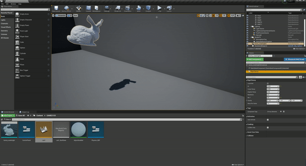

# [GAMES103](https://games-cn.org/games103/) Lab1


This is a simple rigid body simulation. Two different methods are used to solve.
## Instruction
1. Clone this repo.
2. Open the ```Lab1.uproject``` with Unreal Engine (4.26.0+).
3. Open the ```Lab1.umap``` or ```Lab1_ShapeMatching.umap```.
4. Click ```Play``` button.
5. Hit ```L``` on keyboard to cast the bunny and see it hits the walls.
6. Hit ```R``` on keyboard to reset the position and velocity of the bunnny.